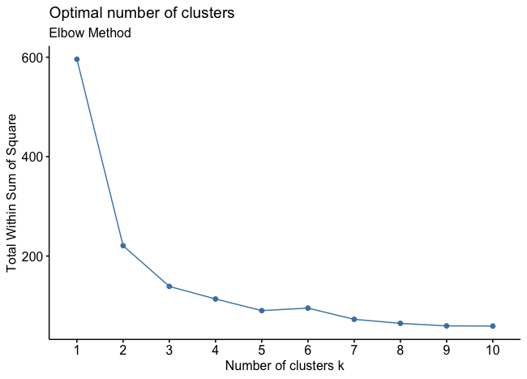
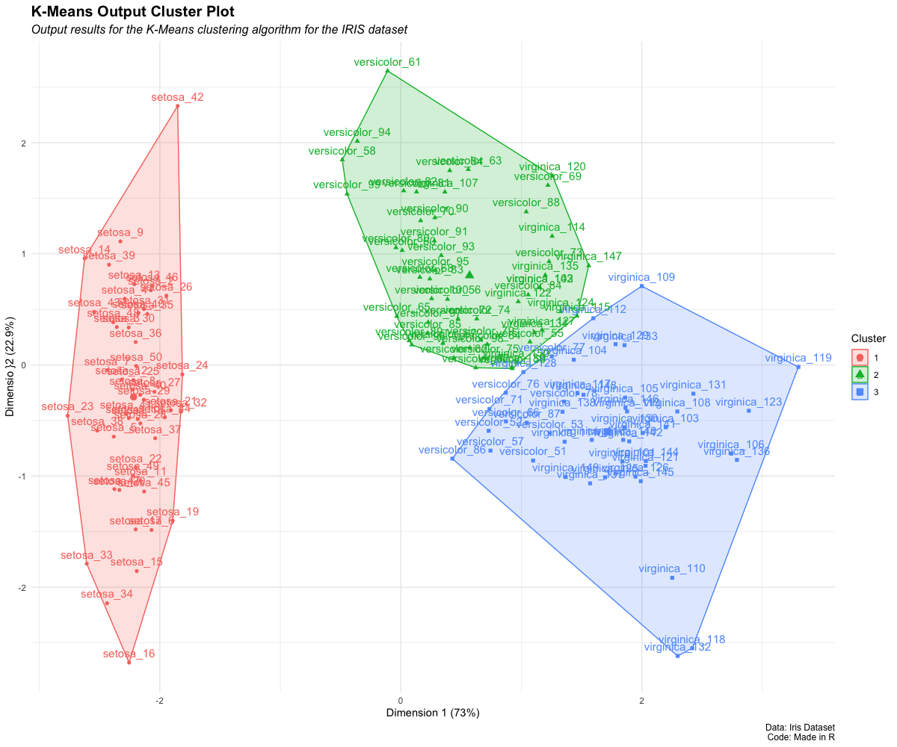

# Carry out K- Means Clustering using `factoextra` package

## Producing high-quality KMeans cluster plots

## Plots include:

### Optimal number of cluster calculations:



and

### KMeans Plots



## Code :

```r

# Loading Packages

library(tidyverse)
library(factoextra)

# Loading Data

data_kmeans <- iris


iris.labels <- iris$Species
table(iris.labels)

# using just the observations

data_kmeans <- iris[1:4]

# scale the data
data_kmeans_scaled <- scale(data_kmeans)

# euclidian distance measure
data_kmeans <- dist(data_kmeans_scaled)


# Calculating Number of clusters needed

fviz_nbclust(data_kmeans_scaled, kmeans,
             method = "wss") + # wss means within sum squares
  labs(subtitle = "Elbow Method")

# I decided to use 3 clusters
# Its very subjective, depending on the data


# KMeans

kmeans_output <- kmeans(data_kmeans_scaled, centers = 3, nstart = 100)

print(kmeans_output)

# Output in console, example cluster assignment:
#Clustering vector:
#[1] 1 1 1 1 1 1 1 1 1 1 1 1 1 1 1 1 1 1 1 1 1 1 1 1 1 1 1 1 1 1 1 1 1 1 1 1 1 1 1 1 1 1 1 1 1 1 1 1 1 1 3 3 3 2 2 2 3 2 2 2 2 2 2 2 2 3
#[67] 2 2 2 2 3 2 2 2 2 3 3 3 2 2 2 2 2 2 2 3 3 2 2 2 2 2 2 2 2 2 2 2 2 2 3 2 3 3 3 3 2 3 3 3 3 3 3 2 2 3 3 3 3 2 3 2 3 2 3 3 2 3 3 3 3 3
#[133] 3 2 2 3 3 3 2 3 3 3 2 3 3 3 2 3 3 2

# To Vizualize the data:

# label clusters
kmeans_output.clusters <- kmeans_output$cluster

# assign rownames to main data:
rownames(data_kmeans_scaled) <- paste(iris$Species, 1:dim(iris)[1], sep="_")

# all rownames should be unique, identical rownames could lead to problems.

# Plot the data
fviz_cluster(list(data = data_kmeans_scaled, cluster = kmeans_output.clusters)) +
  theme_minimal() +
  theme(plot.subtitle = element_text(size = 12,
                               face = "italic"),
  plot.caption = element_text(size = 9),
  plot.title = element_text(size = 15,
                            face = "bold")
) + labs(
  title = "K-Means Output Cluster Plot",
  x = "Dimension 1 (73%)",
  y = "Dimensio }2 (22.9%)",
  colour = "Cluster",
  fill = "Cluster",
  shape = "Cluster",
  subtitle = "Output results for the K-Means clustering algorithm for the IRIS dataset",
  caption = "Data: Iris Dataset
Code: Made in R"
)


# in Table form
table(kmeans_output.clusters, iris$Species)

#kmeans_output.clusters setosa versicolor virginica
#1     50          0         0
#2      0         39        14
#3      0         11        36


```
