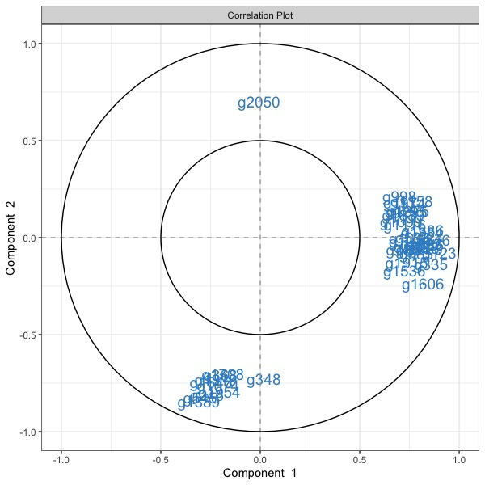
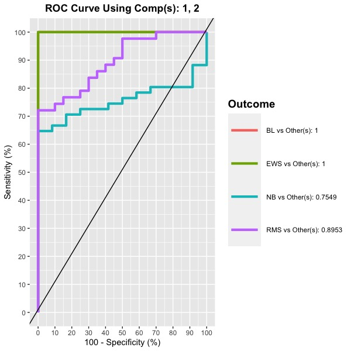
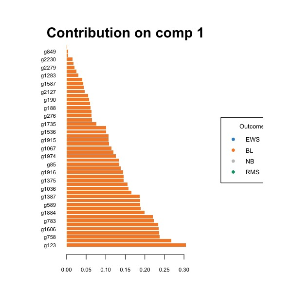

# PLS-DA and s-PLS-DA Analysis using the `mixOmics` package

## Produce great looking plots and carry out dimensional analysis in a few lines of code.

## Some of the plots include:

## PLS-DA Plots:


## Correlation - Variance plot



## ROC



## Loadings plot



### Code:

```r
# Loading the dataset
library(mixOmics)

# Loading the data
data(srbct)

# setting X and Y
X <- srbct$gene
Y <- srbct$class
summary(Y)


# Run the SPLS-DA method
MyResult.splsda <-
  splsda(X, Y, keepX = c(50, 50)) # 1 Run the method


# Plot the samples (colored by classes automatically)
plotIndiv(MyResult.splsda)


# create a background prediction surface
background <-
  background.predict(MyResult.splsda, comp.predicted = 2,
                     dist = "max.dist")

# plot the PLS-DA plot using the created background
plotIndiv(
  MyResult.splsda,
  comp = 1:2,
  group = srbct$class,
  ind.names = FALSE,
  title = "PLS-DA of SRBCT Data",
  ellipse = TRUE,
  legend = TRUE,
  background = background
)

# Correlation Variance plot
plotVar(MyResult.splsda, cutoff = 0.7,
        title = "Correlation Plot")


# ROC Plot
auroc(MyResult.splsda)


# Loadings Plot
plotLoadings(MyResult.splsda, contrib = 'max', method = 'mean')


```
