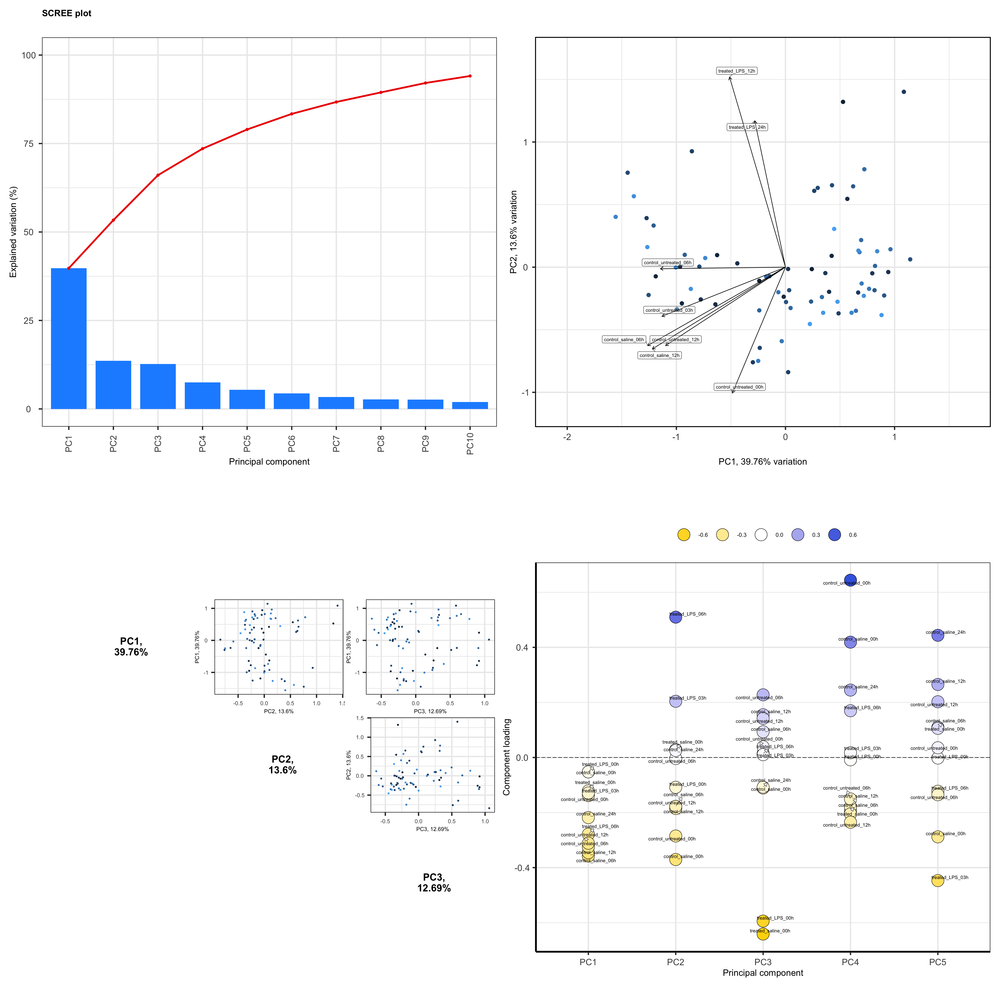

# Detailed PCA Analysis output using R with the `PCA Tools` package

### Make a publication-ready PCA plots

(Using real metabolomics samples data, instead of the mtcars dataset)

### End Result:



### Code:

Each step is explained using corresponding comments.

```r
# Loading Libraries used
library(tidyverse)
library(PCAtools)
library(patchwork)


# reading the data, no non-numeric columns should be added.
metabolites <- read.csv("metabolites.csv", row.names = "compound")

metabolites <- t(metabolites)


# carrying out analysis, remove lower 10% variables
pca_analysis <- pca(metabolites ,
                    removeVar = 0.1)


# screeplot
p1 <- screeplot(pca_analysis,
                getComponents(pca_analysis, 1:10))


# biplot
p2 <- biplot(pca_analysis,
             showLoadings = TRUE, lab = NULL)


# pairsplot
p3 <- pairsplot(pca_analysis,
                getComponents(pca_analysis, c(1:3)))


# loadings plot
p4 <- plotloadings(pca_analysis, labSize = 3)


# looking at the data at a glance.
pca_analysis$rotated[1:5, 1:5]


# combining all plots together
p_final <- (p1 + p2) / (p3 + p4)
p_final


# save as png
ggsave("p_final.png",
       width = 25,
       height = 25,
       dpi = 200)

```
