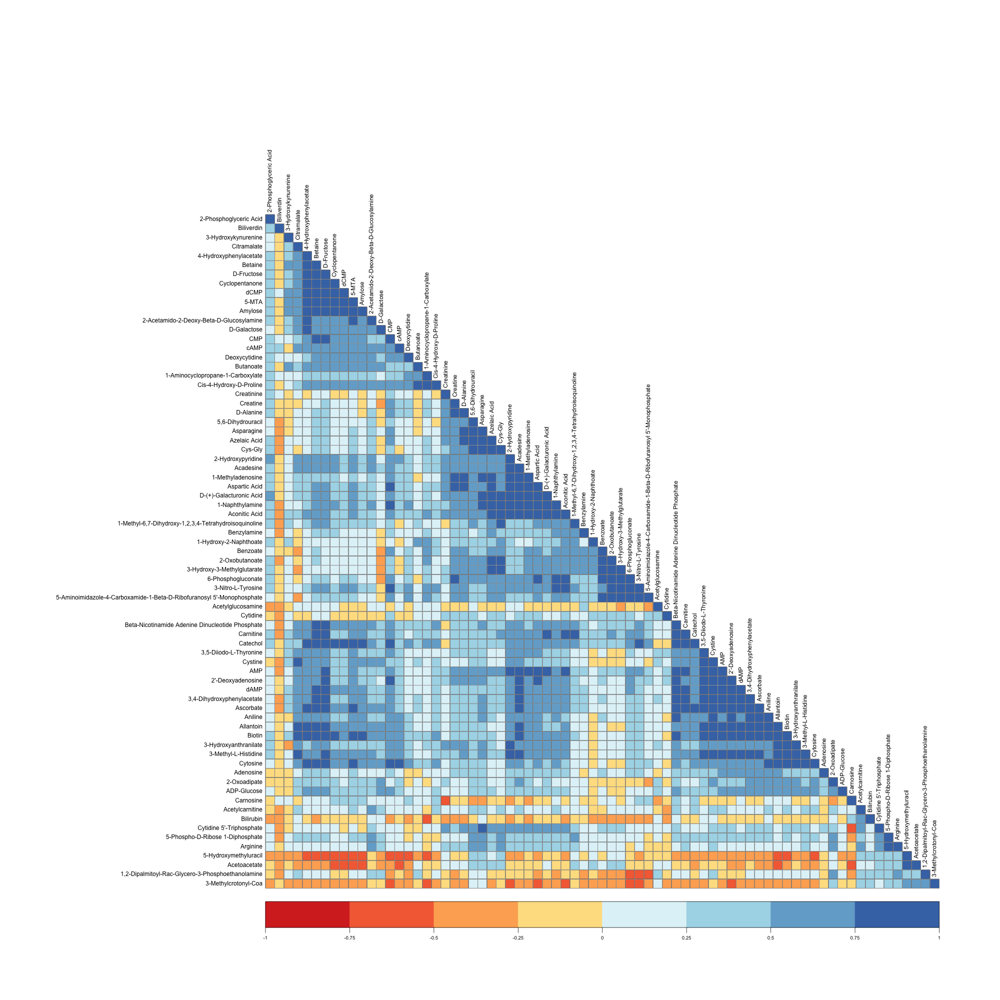

# Making a correlation matrix using R with the `corrplot` package

### Make a publication-ready correlation matrix using less than 10 lines of code.

(Using real metabolomics samples data, instead of the mtcars dataset)

### End Result:



### Code:

Each step is explained using corresponding comments.

```r


# Loading the required libraries

library(corrplot) # used for making the plot
library(tidyverse) # data reading and writing
library(RColorBrewer) # add colors to plot


# read your csv (or excel file)
metabolites <- read.csv("metabolites.csv")

# convert the data into a matrix, remove the compounds row
metabolites_df <- as.matrix(metabolites[, -1])

# convert default rownames to compounds
rownames(metabolites_df) <- metabolites$compound


# carry out the correlation
correlation_plot <-cor(t(metabolites_df))


# save the plot by initiating the device. Much more control than exporting using plot viewer
png(filename = "correlation_plot.png", width = 2000, height = 2000, units = "px")

# make the plot
correlation_1 <- corrplot(correlation_plot, type="lower", order="hclust",method = "color",
         col=brewer.pal(n=8, name="RdYlBu"),addgrid.col = "darkgray", outline = T, tl.cex = 1, tl.col = "black")

# turn off the dev to finish exporting.
dev.off()


```

If you have any questions/suggestions reach out to me on my twitter.
