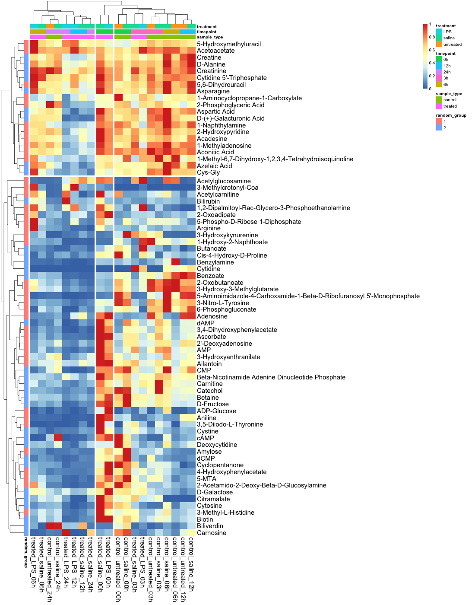

# Making a detailed, multi-level heatmap using R with the `pheatmap` package

### Make a publication-ready heatmaps

(Using real metabolomics samples data, instead of the mtcars dataset)

### End Result:



### Code:

Each step is explained using corresponding comments.

```r


# Loading required packages
library(tidyverse)
library(pheatmap)


# reading the data, import compounds (or features as rownames)
metabolites <- read.csv("metabolites.csv", row.names = "compound")


# optional, but if you want to add column annotations
# separate columns by sample types, time points etc.
my_sample_col <-
  data.frame(
    sample_type = rep(
      c(
        "control",
        "treated",
        "control",
        "treated",
        "control",
        "treated",
        "control",
        "treated",
        "control",
        "treated"
      ),
      c(2, 2,
        2, 2,
        2, 2,
        2, 2,
        2, 2)
    ),
    timepoint = rep(c("0h", "3h", "6h", "12h", "24h"), c(4, 4, 4, 4, 4)),
    treatment = rep(
      c(
        "untreated",
        "saline",
        "LPS",
        "untreated",
        "saline",
        "LPS",
        "untreated",
        "saline",
        "LPS",
        "untreated",
        "saline",
        "LPS",
        "untreated",
        "saline",
        "LPS"
      ),
      c(1, 2, 1,
        1, 2, 1,
        1, 2, 1,
        1, 2, 1,
        1, 2, 1)
    )
  )
# add annotiations as col_names to original data
row.names(my_sample_col) <- colnames(metabolites)


# similarly for row annotations.
my_sample_row <-
  data.frame(random_group = rep(c("1", "2"), c(40, 33)))
row.names(my_sample_row) <- rownames(metabolites)


# turn on png device, to save high quality image
png("heatmap_final.png",
    width = 1100,
    height = 1400,
    units = "px")


# make the heatmap
pheatmap::pheatmap(
  metabolites,
  fontsize_row = 15,
  border_color = "black",
  cluster_col = T,
  cutree_rows = 2,
  cutree_cols = 3,
  fontsize_col = 15,
  annotation_col = my_sample_col,
  annotation_row = my_sample_row
)

# turn off the png device
dev.off()


```

If you have any questions/suggestions reach out to me on my twitter.
