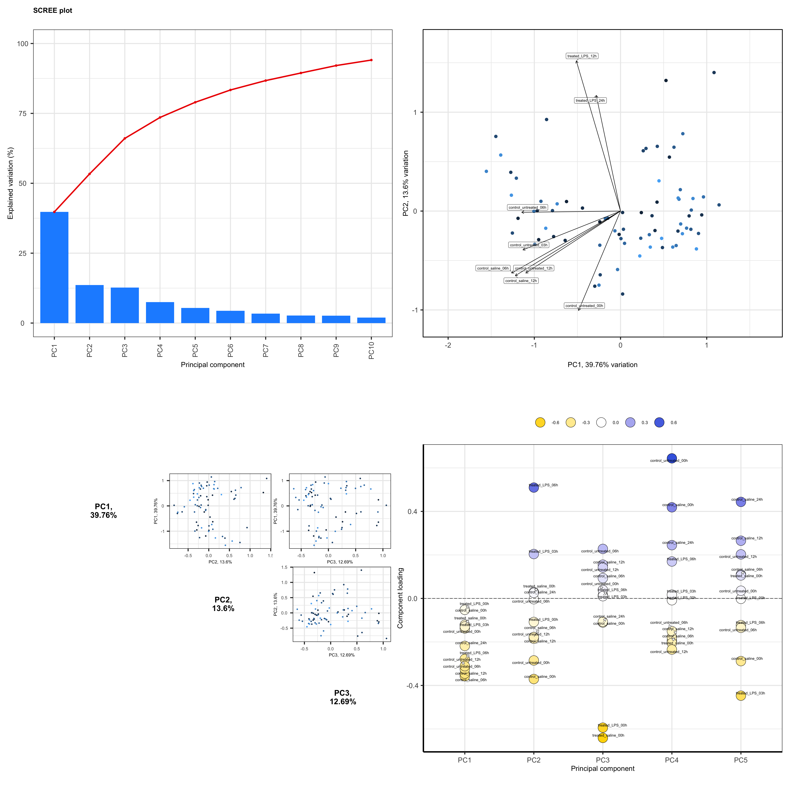
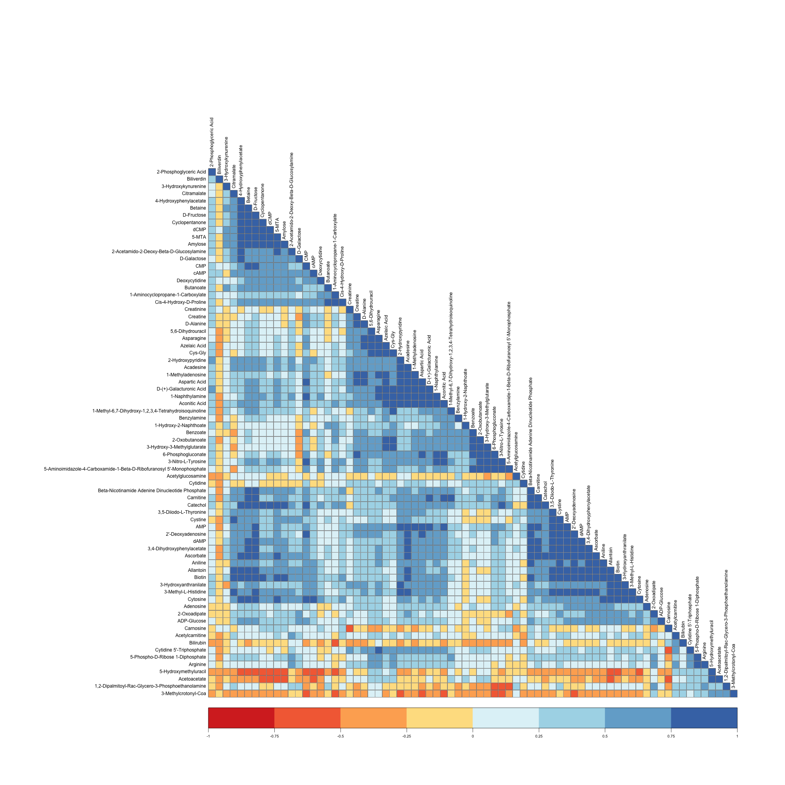

# How to use R and R Packages for some common metabolomics tests and visualizations.

The goal of this repository/project is for other metabolomics and other biological scientists and data-science researchers to find quick solutions for code they might need to carry out various types of data analysis and data visualizations while using R.

None of these packages are written by me, so a huge thanks to the people who compiled them.

_This is a work in progress._

### Some of the code you'll find in this repo will help you with :

### Publication -ready PCA analysis plots

### Publication Quality ANOVA tables

### Making a beautiful correlation matrix

### PLS-DA and SPLS-DA analysis

### Making Multi-Level heatmaps

